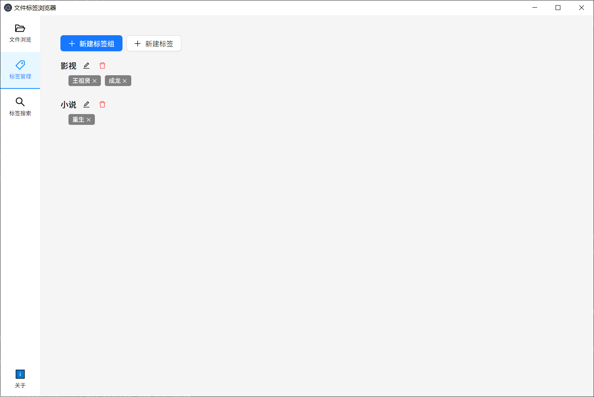
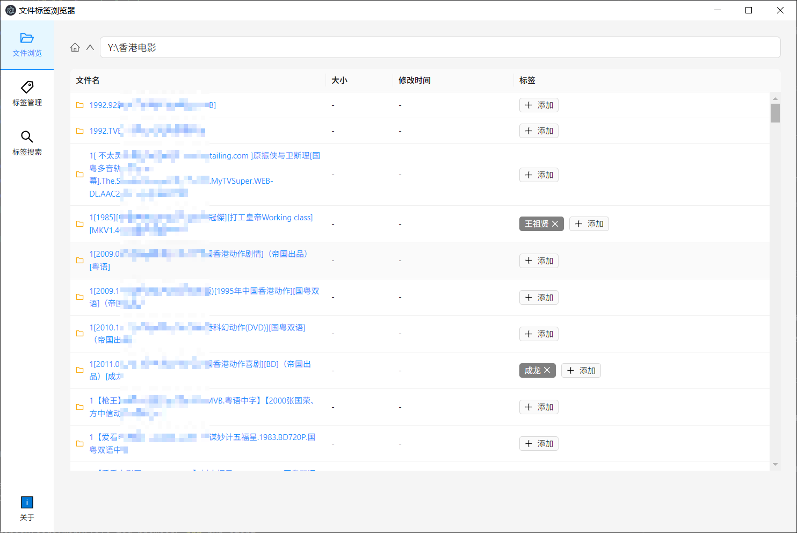
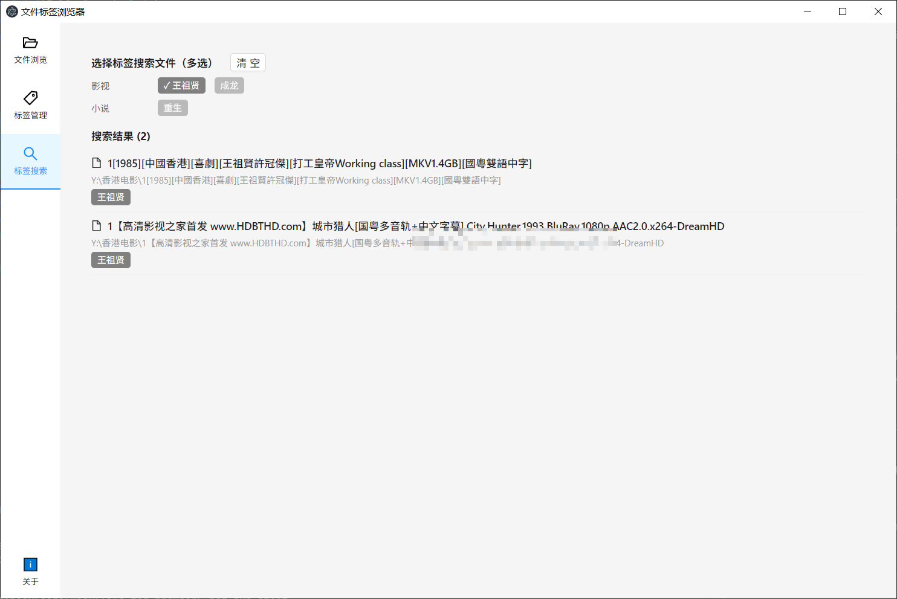

# 项目说明：

本人是一个有点仓鼠的人，希望收集文件。文件搜集多之后，对于一些文件希望它能有一些标签，方便我进行回顾。
例如我收集了一批小说，我希望能给它打分，能标记它的类型。也就是给文件加上各种各样的标签。
例如某天我想看王祖贤出演的电影，我可以根据我自己创建的标签来搜索。
由于本人需求特别，也就没有使用例如 eagle（图片素材管理，支持标签管理）、一些影视刮削软件。

本项目是文件标签浏览器的 v2 版本，使用 Tauri 2.x 重写，相比 v1（Electron 版）有以下改进：

- 打包体积从 ~150 MB 缩减到 ~20 MB
- 启动速度更快、内存占用更低
- 去掉 sql.js，将 SQLite 操作整体搬到 Rust 端（rusqlite），前端不再处理 wasm
- 用原生 Win32 API 替换 PowerShell 枚举磁盘

## 软件说明：

- 本软件仅在本地运行，没有联网功能。
- 软件没有删除文件功能，也不能打开文件，只能给文件、文件夹进行标签管理。标签存储在数据库中。
- 软件启动时，会自动创建数据库文件。如果数据库文件不存在，会自动创建。数据库会自动创建在程序运行目录下，数据库名为 tags.db。移动程序时，请一起移动。
- 仓鼠可能会移动文件，借助文件夹归类文件，为了让标签不丢失，会对【文件】进行 hash 计算，只计算文件头尾各 1 MB，避免全文件读取性能问题。所以即使是文件路径变化，也可以识别出文件并重新填写标签（同步标签功能）。
- 文件夹的不方便计算，所以目前只能根据文件路径来识别文件夹。如果文件夹路径变化，无法重新同步标签。但 v2 增加了基于 `<uuid>.tag` 文件的文件夹标签重映射机制：首次给文件夹打标签时会写入一个 `<uuid>.tag` 文件，下次扫描到含此文件的文件夹时可以自动恢复历史标签。

## AI 开发说明

使用模型：MiniMax-M3
IDE：Trae

## 技术栈

| 类别 | 技术 |
|------|------|
| 框架 | Tauri 2.x |
| 前端 | React 18 + Ant Design 5 + TypeScript |
| 打包 | Vite + tauri build |
| 数据库 | rusqlite（Rust 原生 SQLite，bundled 静态链接） |
| 构建工具 | TypeScript 5 + Vite 5 |
| 拖拽 | @dnd-kit/core + @dnd-kit/sortable |
| 拼音 | pinyin-pro |
| Rust crates | tauri、tauri-plugin-dialog、tauri-plugin-shell、tauri-plugin-global-shortcut、rusqlite、parking_lot、sha2、uuid、serde |

## 项目结构

```
file-tag-browser-v2/
├── package.json              # 前端依赖与脚本
├── vite.config.ts            # Vite 构建配置
├── tsconfig.json             # TypeScript 配置
├── index.html                # 前端入口 HTML
├── public/                   # 静态资源
│   └── icon.png              # 应用图标
├── src/                      # 前端代码
│   ├── main.tsx              # React 入口
│   ├── App.tsx               # 主 UI 组件
│   ├── App.css               # 样式
│   └── api/                  # API 封装
│       ├── types.ts          # 共享类型定义（与 Rust 序列化字段对齐）
│       ├── tauri.ts          # Tauri invoke 封装
│       └── repo.ts           # 业务 API 层
└── src-tauri/                # Rust 端代码
    ├── Cargo.toml
    ├── tauri.conf.json
    ├── build.rs
    ├── capabilities/         # 权限声明
    │   └── default.json
    ├── icons/                # 应用图标（png/ico）
    └── src/
        ├── main.rs           # 二进制入口
        ├── lib.rs            # 库入口，注册所有 Tauri 命令
        └── commands/         # 命令实现
            ├── fs.rs            # scan_folder、stat_path
            ├── folder_tag.rs    # uuid.tag 文件创建/读取
            ├── hash.rs          # sha256 文件头尾各 1MB
            ├── drives.rs        # Win32 API 枚举磁盘
            ├── dialog.rs        # 文件夹选择、打开文件、用资源管理器打开
            ├── db_path.rs       # tags.db 路径（exe 同级目录）
            └── db.rs            # 全部 CRUD（rusqlite 封装）
```

## 功能说明与演示

### 1. 文件浏览

用户可以浏览本地磁盘的文件和文件夹。

**流程：**

1. 启动应用 → 显示磁盘驱动器列表
2. 点击磁盘或文件夹 → 进入目录
3. 系统扫描目录内容 → 调用 Rust `scan_folder` 命令
4. 同时查询数据库获取已有标签 → 调用 Rust `get_file_tags_by_paths` 命令
5. 合并数据渲染文件列表，标签信息实时显示

**核心代码路径：**
- Rust 命令：[src-tauri/src/commands/fs.rs - scan_folder](src-tauri/src/commands/fs.rs)
- Rust 数据库：[src-tauri/src/commands/db.rs - get_file_tags_by_paths](src-tauri/src/commands/db.rs)
- 前端调用：[src/App.tsx - navigateTo 函数](src/App.tsx)
- 前端 API：[src/api/repo.ts - getByPaths](src/api/repo.ts)

### 2. 标签管理

用户可以创建标签组和标签，统一管理系统中的所有标签。

**流程：**

1. 点击侧边栏「标签管理」
2. 创建标签组（可选） → 调用 Rust `create_tag_group`
3. 创建标签并选择所属分组 → 调用 Rust `create_tag`
4. 支持编辑和删除标签组/标签
5. 支持拖拽标签调整顺序

**核心代码路径：**
- 创建标签：[src-tauri/src/commands/db.rs - create_tag](src-tauri/src/commands/db.rs)
- 创建标签组：[src-tauri/src/commands/db.rs - create_tag_group](src-tauri/src/commands/db.rs)
- 拖拽排序：[src-tauri/src/commands/db.rs - update_tag_order](src-tauri/src/commands/db.rs)
- 数据库表：[src-tauri/src/commands/db.rs - CREATE TABLE](src-tauri/src/commands/db.rs)



### 3. 文件打标签

用户可以为文件或文件夹添加标签。

**流程：**

1. 在文件列表中点击「添加」标签
2. 弹出标签选择弹窗，选择标签
3. 调用 Rust `add_file_tag`
   - 如果文件首次添加标签：INSERT files 记录 → INSERT file_tags 关联
   - 如果文件已在数据库中：直接 INSERT file_tags 关联
4. 局部更新文件列表显示新标签

**核心代码路径：**
- Rust 命令：[src-tauri/src/commands/db.rs - add_file_tag](src-tauri/src/commands/db.rs)
- 前端 API：[src/api/repo.ts - addFileTag](src/api/repo.ts)
- 渲染弹窗：[src/App.tsx - openFileTagModal](src/App.tsx)




### 4. 批量打标签

用户可以批量给多个文件或文件夹添加/移除标签。

**流程：**

1. 在文件浏览模式下，勾选要操作的文件或文件夹（支持多选）
2. 点击「批量添加标签」或「批量移除标签」
3. 在弹窗中选择标签
4. 系统自动处理，跳过已有该标签的文件

**功能特点：**
- 支持文件和文件夹批量操作
- 批量添加时，自动跳过已有该标签的文件
- 批量移除时，移除选中文件上已有的标签
- 支持拼音搜索

**核心代码路径：**
- Rust 命令：[src-tauri/src/commands/db.rs - batch_add_tags / batch_remove_tags](src-tauri/src/commands/db.rs)

### 5. 标签搜索

用户可以通过标签筛选文件。

**流程：**

1. 点击侧边栏「标签搜索」
2. 选择一个或多个标签
3. 调用 Rust `search_by_tag` 查询数据库
4. 支持多标签交集搜索（AND 逻辑）
5. 显示符合条件的文件列表
6. 搜索结果右侧可「打开文件」、「打开所在目录」（调用 Windows 资源管理器）

**核心代码路径：**
- 单标签搜索：[src-tauri/src/commands/db.rs - search_by_tag](src-tauri/src/commands/db.rs)
- 多标签搜索：[src/App.tsx - handleSearchByTag](src/App.tsx)
- 资源管理器打开：[src-tauri/src/commands/dialog.rs - open_in_explorer](src-tauri/src/commands/dialog.rs)



### 6. 同步标签

当用户的文件被移动或复制后，可以通过同步功能自动将原文件的标签复制到新文件。

**流程：**

1. 进入要同步的文件夹
2. 点击工具栏「同步标签」按钮
3. 系统扫描文件夹内所有条目：
   - 文件：计算 sha256（头尾各 1MB），与数据库中已有 hash 的文件匹配，命中后自动入库并复制标签
   - 文件夹：读取 `<uuid>.tag` 文件，匹配历史同 uuid 的文件夹记录并复制标签
4. 返回同步结果（synced 数量 + total 数量）

**核心代码路径：**
- [src-tauri/src/commands/db.rs - sync_folder](src-tauri/src/commands/db.rs)
- [src-tauri/src/commands/db.rs - remap_one_folder](src-tauri/src/commands/db.rs)
- [src-tauri/src/commands/hash.rs - compute_file_hash](src-tauri/src/commands/hash.rs)

### 7. 驱动器检测

自动检测本地磁盘和网络磁盘。

**流程：**

1. 应用启动时调用 Rust `get_drives` 命令
2. 通过 Win32 API `GetLogicalDrives` + `GetDriveTypeW` + `GetDiskFreeSpaceExW` 枚举
3. 筛选本地磁盘（DriveType=3）和网络磁盘（DriveType=4）
4. 返回磁盘名称、容量、剩余空间

**相比 v1 改进：**
- 不再依赖 PowerShell 进程启动，启动更快
- 用原生 Win32 API，枚举性能更优

**核心代码路径：**
- [src-tauri/src/commands/drives.rs - get_drives](src-tauri/src/commands/drives.rs)

### 8. 添加标签弹窗搜索

在添加标签弹窗中，支持中英文拼音搜索。

**功能特点：**

- 输入汉字直接匹配（如：输入"周"匹配"周"）
- 输入拼音匹配汉字（如：输入"zhou"匹配"周"）
- 输入英文直接匹配（如：输入"test"匹配"test"）
- 支持 pinyin-pro 自动转换，无需手动维护拼音映射

**核心代码路径：**
- 模糊匹配：[src/App.tsx - fuzzyMatch](src/App.tsx)

### 9. 关于 & 使用说明

点击侧边栏「使用说明」按钮，查看本程序的五大功能简述。
点击侧边栏「关于」按钮，显示应用信息。

**包含内容：**
- 应用名称
- 版本号
- 作者信息
- GitHub 地址
- 开源协议（MIT）


## 数据库结构

| 表名 | 说明 |
|------|------|
| files | 文件记录表（含 file_path、file_hash、is_directory 等） |
| tag_groups | 标签分组表（含 sort_order 排序字段） |
| tags | 标签表（含 group_id、sort_order 排序字段） |
| file_tags | 文件-标签关联表（多对多） |

数据库建表与列迁移由 Rust 端 `db::init_db` 在 setup 阶段自动完成；新增字段采用 `ALTER TABLE ... ADD COLUMN` 模式，老数据库无缝升级。

## 开发与运行

```powershell
# 安装前端依赖
npm install

# 开发模式（Vite + Tauri 热重载）
npm run tauri:dev

# 仅前端
npm run dev

# 打包（生成 release exe）
npx tauri build --bundles nsis --no-bundle
```

首次 `cargo build` 会下载并编译约 400 个 crate（含 rusqlite 的 C 源码），耗时 10-30 分钟，后续增量编译很快。

## 打包说明

详细打包流程与产物说明见 [docs/打包说明.md](docs/打包说明.md)。

## 快捷键

| 快捷键 | 功能 |
|--------|------|
| Ctrl+Shift+I | 打开/关闭开发者工具 |
| F12 | 打开/关闭开发者工具 |

## v1 → v2 主要变更

| 项 | v1（Electron） | v2（Tauri） |
|------|----------------|------------|
| 打包体积 | ~150 MB | ~20 MB |
| 启动内存 | ~150 MB | ~40 MB |
| 数据库 | sql.js (wasm) | rusqlite (Rust 原生) |
| 启动方式 | Node 主进程 | Rust 二进制 |
| 资源管理器打开 | electron.shell | explorer.exe |
| 磁盘枚举 | PowerShell | Win32 API |
| 前端 | Webpack | Vite |
| 跨平台 | Web 技术 | Web 技术（共享）+ Rust 跨平台 IO |
| 进程模型 | 多进程（主+渲染） | 单进程（Rust + WebView2） |

## 相关文档

- [打包说明](docs/打包说明.md)

## 免责说明

本项目由 AI 辅助开发，代码含量为 100%，本人只负责项目的设计，并不断跟 AI 对话由 LLM 调整功能。

## 喝奶茶

如果这个软件对您有帮助，欢迎请我喝杯奶茶 🥤

